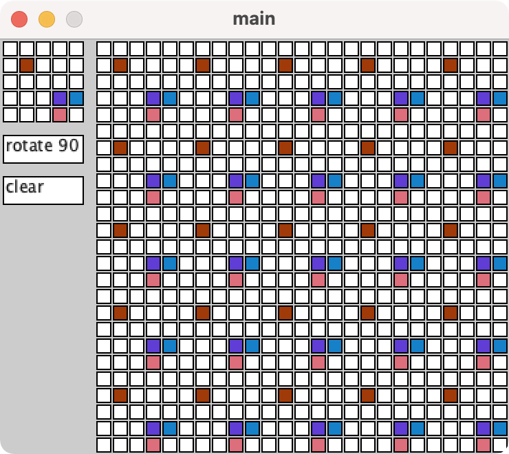

# Pattern Tesselation

A clickable grid of cells that recieve a random colour when clicked. A button enables the pattern to be rotated 90, this updates the rest of the tesselated patterns. Additionally, there is a clear button that empties the array, and subsequently the pattern.

The most tedious part of this project was figuring out the mouse boundaries of the buttons. However, once I'd swapped it all from hardcoded numbers it all fell into place a lot easier.
This project was initially an assignment given to me during my University course; however for some unbeknown reason(🍺) it never recieved the polish it deserved. 
Infact, rather embarrassingly, I couldn't even get the basic matrix rotation working - please bear in mind this was over 3 years ago 😳.
The entire project was rewritten to avoid any copyright/usage infringements.

Available for demo on my [website](https://www.maxpetts.me) 
